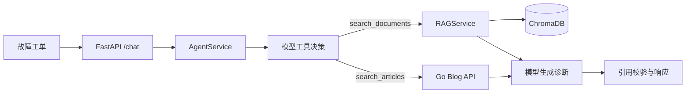

# Developer Incident Agent

中文名称：基于 LangChain Tool Calling 与 RAG 的研发故障工单诊断 Agent。

这是一个面向 AI 应用开发学习和实习展示的轻量项目。用户上传 PDF 或 Markdown
故障手册后，可以提交错误日志或故障描述；Agent 会选择一个检索工具，并根据真实工具结果
输出症状概括、可能原因、排查步骤和来源。

项目关注的是可解释、可测试的模型调用链路，不追求复杂自主规划。

## 核心场景

- `search_documents`：对上传的故障手册和技术文档进行 Chroma 向量检索。
- `search_articles`：真实请求 Go 博客标题搜索接口，寻找相关排障文章。
- 简单问候或无需外部依据的问题由模型直接回答。

每个 `/chat` 请求最多执行一个工具。第一次模型调用负责工具决策；如果选择工具，
程序执行后只再调用一次未绑定工具的模型生成答案。因此单次请求最多调用模型两次，
不存在循环规划。

## LangChain 用在哪里

- 使用 `StructuredTool` 定义带 Pydantic 参数模型的真实工具对象。
- 使用 `ChatOpenAI.bind_tools()` 注册由同一参数模型生成的严格工具 schema。
- 使用 LangChain 消息类型传递系统提示、用户工单和工具结果。
- 使用 `langchain-text-splitters` 与 `langchain-chroma` 完成文档切分和向量检索集成。

本项目没有使用 `langchain.agents.create_agent()`。当前 LangChain 的完整 Agent runtime
底层采用 LangGraph 和循环式工具执行，与本项目“一次工具、两次模型”的硬边界不一致。
因此这里采用 LangChain 提供的工具抽象与模型集成，自行实现一个固定两阶段执行器。

## 请求链路



文档导入：

```text
上传 -> SHA-256 去重 -> 按页解析 -> 页内切片 -> Embedding -> Chroma 持久化
```

PDF 保留从 1 开始的真实页码，Markdown 页码固定为 1。相同内容的文件不会重复写入；
进程内的并发上传通过临界区串行完成查重和索引写入。

故障诊断：

```text
工单 -> 模型原生 Tool Calling -> 零或一个工具 -> 程序构造真实 sources
     -> 可选的第二次模型总结 -> 引用校验 -> 回答
```

`sources` 只由程序从工具结果构造。第二次模型调用只接收来源编号和内容，不接收文件名、
页码或文章标题；回答正文只能引用来源编号，来源元数据统一由结构化 `sources` 返回。
程序会拒绝缺少引用、引用未知编号或包含非受控来源元数据的模型回答。

## 项目结构

```text
app/main.py          FastAPI 接口与应用工厂
app/models.py        API、来源和工具参数模型
app/agent/           LangChain 工具与受控执行器
app/rag/             文档解析、切分和向量检索
app/integrations/    Go 博客 HTTP 客户端
tests/               完全离线的接口和服务测试
evals/               固定路由/检索评测集与评测器
examples/            可直接上传的故障手册
```

## 本地运行

要求 Python 3.11。

```bash
pip install -e ".[dev]"
copy .env.example .env
```

在 `.env` 中配置：

```text
CHAT_API_KEY=
CHAT_BASE_URL=
CHAT_MODEL=
EMBEDDING_API_KEY=
EMBEDDING_BASE_URL=
EMBEDDING_MODEL=
```

聊天和 Embedding 可以使用不同的密钥与 OpenAI 兼容服务。为兼容旧配置，
`OPENAI_API_KEY` 和 `OPENAI_BASE_URL` 会在对应独立配置为空时作为共同回退。
未配置模型时应用仍能启动，
`GET /health` 仍返回状态；实际聊天或文档向量化会返回明确错误。

```bash
uvicorn app.main:app --reload
```

Swagger 地址：<http://127.0.0.1:8000/docs>。

先上传示例故障手册：

```bash
curl -F "file=@examples/redis_connection_timeout.md" \
  http://127.0.0.1:8000/documents
```

再提交故障工单：

```bash
curl -X POST http://127.0.0.1:8000/chat \
  -H "Content-Type: application/json" \
  -d "{\"question\":\"Redis 连接池持续超时，应按什么顺序排查？\",\"top_k\":4}"
```

博客工具演示问题：

```text
我的博客里有没有 Go 连接池超时排查文章？
```

## Go 博客接口

项目真实请求：

```text
GET /api/article/search?keyword={keyword}
```

默认地址为 `http://localhost:8080`，可通过 `BLOG_API_BASE_URL` 修改。该公开搜索接口
不添加 JWT。客户端会分别处理 HTTP 超时、连接失败、非法 JSON、异常 HTTP 状态和业务
`code != 0`。

## 离线测试

```bash
python -m compileall app
ruff check .
pytest -q
```

测试使用 Fake 模型、Embedding、向量存储和博客客户端，不访问真实模型、真实 Go 服务或外部网络。
FastAPI 测试通过 `dependency_overrides` 替换真实依赖。

## AI 效果评测

固定评测集包含：

- 30 条工具路由问题：文档检索、博客搜索、无需工具各 10 条。
- 5 篇故障手册和 15 条检索问题。
- 路由指标：Accuracy、多工具调用率。
- 检索指标：Hit@1、Hit@3、MRR。

真实评测会产生模型 API 费用：

```bash
python -m evals.run_evaluation --mode all \
  --output evals/results/latest.json
```

评测结果只代表固定小规模数据集、模型和配置。在重新运行当前故障场景评测前，
README 和简历不应填写百分比结果。

## Docker

```bash
docker build -t developer-incident-agent .
docker run --rm -p 8000:8000 --env-file .env \
  -v "${PWD}/data/uploads:/app/data/uploads" \
  -v "${PWD}/data/chroma:/app/data/chroma" \
  developer-incident-agent
```

镜像通过 `uvicorn app.main:app` 启动，并使用 UID `10001` 的非 root 用户运行。

## 设计边界

- 仅有 `search_documents` 和 `search_articles` 两个工具。
- 每次请求最多执行一个工具、最多调用模型两次。
- `/chat` 请求中的 `top_k` 由服务端强制注入，模型不能覆盖。
- 第二次模型调用不绑定工具；若仍返回工具调用，响应 `AGENT_TOOL_LIMIT`。
- 不包含 LangGraph 工作流、多 Agent、长期记忆、MCP、BM25、Reranker、前端或登录系统。
- 只支持 PDF 和 Markdown，不支持扫描 PDF 的 OCR。
- 博客搜索是标题关键词匹配，不是语义检索。
- 这是学习和实习展示项目，不是生产系统。

## 面试时应能讲清

- 为什么使用 LangChain `StructuredTool`，但不采用循环式 `create_agent` runtime。
- 第一次模型工具决策、工具执行和第二次答案生成之间的数据流。
- 为什么一次只允许一个工具，以及第二次调用为何禁止继续调用工具。
- 文档去重、页码保留和引用防编造机制。
- Tool Calling 路由与 RAG 检索分别如何离线评测。
- HTTP 客户端异常映射和 FastAPI 依赖替换。

## 许可证

MIT，见 [LICENSE](LICENSE)。
