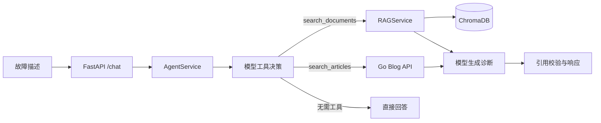

# Developer Incident Agent

Developer Incident Agent 是一个基于 FastAPI、LangChain Tool Calling 和 RAG 的研发故障诊断服务。它可以检索用户上传的 PDF 或 Markdown 技术文档，也可以调用 Go 博客文章搜索接口，并根据检索结果生成包含来源引用的排查建议。

## 功能特性

- 上传并解析 PDF、Markdown 技术文档。
- 使用 SHA-256 对上传内容去重。
- 保留 PDF 页码并在页内切分文本。
- 通过 ChromaDB 持久化文档向量。
- 使用 `search_documents` 检索上传的文档。
- 使用 `search_articles` 搜索 Go 博客文章标题。
- 返回症状概括、可能原因、排查步骤和结构化来源。
- 校验模型生成的来源引用，避免返回未经工具结果支持的来源信息。
- 提供离线单元测试、接口测试和固定数据集评测。

## 系统架构



文档导入流程：

```text
上传 -> SHA-256 去重 -> 按页解析 -> 页内切分 -> Embedding -> ChromaDB
```

故障诊断流程：

```text
故障描述 -> 模型选择零个或一个工具 -> 执行工具 -> 构造来源数据
         -> 模型生成诊断 -> 校验引用 -> 返回响应
```

每个 `/chat` 请求最多执行一个工具、最多调用模型两次。第一次模型调用负责决定是否使用工具；工具执行完成后，第二次模型调用根据检索结果生成最终回答。第二次调用不绑定工具，执行流程不会进入循环。

## LangChain 集成

- 使用 `StructuredTool` 定义工具及其 Pydantic 参数模型。
- 使用 `ChatOpenAI.bind_tools()` 向模型注册工具 schema。
- 使用 LangChain 消息类型传递系统指令、用户输入和工具结果。
- 使用 `langchain-text-splitters` 完成文档切分。
- 使用 `langchain-chroma` 集成向量存储与检索。

服务采用固定的两阶段执行流程，以保证工具数量和模型调用次数具有明确上限。

## 项目结构

```text
app/main.py          FastAPI 路由与应用工厂
app/models.py        API 请求、响应和工具参数模型
app/config.py        环境变量与运行配置
app/dependencies.py  服务依赖的创建与注入
app/agent/           工具定义和受控执行流程
app/rag/             文档解析、切分、索引与向量检索
app/integrations/    Go 博客 HTTP 客户端
tests/               离线单元测试与接口测试
evals/               路由和检索评测数据及评测脚本
examples/            可用于测试文档上传的示例资料
```

## 环境要求

- Python 3.11
- 可用的 OpenAI 兼容聊天模型接口
- 可用的 OpenAI 兼容 Embedding 接口
- Docker（可选）

## 本地运行

克隆仓库并进入项目目录：

```bash
git clone https://github.com/Haiqinyan121/developer-incident-agent.git
cd developer-incident-agent
```

建议创建虚拟环境：

```bash
python -m venv .venv
```

Linux 或 macOS：

```bash
source .venv/bin/activate
```

Windows PowerShell：

```powershell
.venv\Scripts\Activate.ps1
```

安装项目及开发依赖：

```bash
python -m pip install -e ".[dev]"
```

复制环境变量模板：

```bash
cp .env.example .env
```

Windows PowerShell 可使用：

```powershell
Copy-Item .env.example .env
```

至少需要配置以下模型参数：

```dotenv
CHAT_API_KEY=
CHAT_BASE_URL=
CHAT_MODEL=
EMBEDDING_API_KEY=
EMBEDDING_BASE_URL=
EMBEDDING_MODEL=
```

聊天模型与 Embedding 模型可以使用不同的密钥和服务地址。`OPENAI_API_KEY` 与 `OPENAI_BASE_URL` 作为共享配置保留；对应的独立配置为空时，服务会使用共享配置。

启动服务：

```bash
uvicorn app.main:app --reload
```

启动后可以访问：

- API 文档：<http://127.0.0.1:8000/docs>
- 健康检查：<http://127.0.0.1:8000/health>

应用未配置模型时仍可启动并提供健康检查；聊天和文档向量化接口会返回相应的配置错误。

## API 使用示例

上传示例文档：

```bash
curl -F "file=@examples/redis_connection_timeout.md" \
  http://127.0.0.1:8000/documents
```

提交故障描述：

```bash
curl -X POST http://127.0.0.1:8000/chat \
  -H "Content-Type: application/json" \
  -d '{"question":"Redis 连接池持续超时，应按什么顺序排查？","top_k":4}'
```

请求体字段：

| 字段 | 类型 | 说明 |
| --- | --- | --- |
| `question` | string | 故障日志、现象或排查问题 |
| `top_k` | integer | 检索结果数量，不能超过服务端配置的 `MAX_TOP_K` |

## Go 博客搜索接口

`search_articles` 调用以下 HTTP 接口：

```text
GET /api/article/search?keyword={keyword}
```

默认服务地址为 `http://localhost:8080`，可以通过 `BLOG_API_BASE_URL` 修改。客户端会处理连接失败、请求超时、异常 HTTP 状态、非法 JSON 以及业务响应 `code != 0`。

## 测试与静态检查

```bash
python -m compileall app
ruff check .
pytest -q
```

测试通过 Fake 模型、Embedding、向量存储和博客客户端隔离外部服务，不会请求真实模型 API、Go 服务或外部网络。FastAPI 接口测试使用 `dependency_overrides` 替换运行时依赖。

## 效果评测

仓库包含固定的路由与检索评测集：

- 30 条工具路由问题，覆盖文档检索、博客搜索和无需工具三种路径。
- 5 篇故障文档和 15 条检索问题。
- 路由指标：Accuracy、多工具调用率。
- 检索指标：Hit@1、Hit@3、MRR。

运行评测：

```bash
python -m evals.run_evaluation --mode all \
  --output evals/results/latest.json
```

评测会调用已配置的模型 API，并可能产生费用。指标结果与评测数据、模型及运行配置相关。

## Docker

构建镜像：

```bash
docker build -t developer-incident-agent .
```

运行容器：

```bash
docker run --rm -p 8000:8000 --env-file .env \
  -v "${PWD}/data/uploads:/app/data/uploads" \
  -v "${PWD}/data/chroma:/app/data/chroma" \
  developer-incident-agent
```

镜像基于 Python 3.11，使用 UID `10001` 的非 root 用户运行。

## 运行约束

- 服务仅注册 `search_documents` 和 `search_articles` 两个工具。
- 每个请求最多执行一个工具、最多调用模型两次。
- `/chat` 中的 `top_k` 由服务端注入工具参数，模型不能修改该值。
- 第二次模型调用不绑定工具；如果模型仍返回工具调用，服务返回 `AGENT_TOOL_LIMIT`。
- 支持包含文本层的 PDF 和 Markdown，不提供扫描 PDF 的 OCR。
- 博客搜索采用标题关键词匹配，不进行语义检索。
- 当前版本不包含用户认证、权限控制和限流，部署到公开网络前应由网关或上层服务提供相应能力。

## 许可证

本项目采用 MIT License，详见 [LICENSE](LICENSE)。
